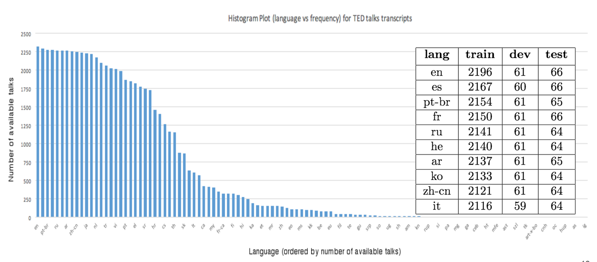

### When and Why are Pre-trained Word Embeddings Useful for Neural Machine Translation?

This page contains the details of the code and TED talks dataset which was used for conducting the experiments included in the above paper. 

The content could also be found at <https://github.com/neulab/word-embeddings-for-nmt>.

### Contents

##### Software:
We used [XNMT](https://github.com/neulab/xnmt) with [commitID 38044b3](https://github.com/neulab/xnmt/tree/38044b36e6263b2608bede28b4e5cf3e4e7accda) for all the experiments.

##### Experiments:

* Datasets for the specific language pairs used in the experiments mentioned in this paper: [qi18naacl-dataset.tar.gz](http://www.phontron.com/qi18naacl-dataset.tar.gz).
* All the configuration files: [experiment_settings.tar.gz](supplementary/experiment_settings.tar.gz).
* Descriptions for configuration files: [experiment\_setting\_specification.xlsx](supplementary/experiment_setting_specification.xlsx).
* Supplementary examples: [supplementary\_figures\_and\_tables.pdf](supplementary/supplementary_figures_and_tables.pdf).

##### Data Processing:
In order to perform experiments, we collected (during early 2017) a common corpus of TED talks which has been translated into many low-resource languages.
Under the [Open Translation project](https://www.ted.com/participate/translate), 
TED talks transcripts are available for more than 2400 talks in 109 languages. 
A histogram plot of language (represented by its ISO Code) vs total number of talks 
in the original dataset is visualized in the figure below.



To obtain a parallel corpus for experiments, we preprocessed the dataset using [Moses tokenizer](https://github.com/moses-smt/mosesdecoder/blob/master/scripts/tokenizer/tokenizer.perl) 
and used hard punctuation symbols to identify valid sentence boundaries for English language. 
In order to create train, dev and test sets, we apply a greedy selection algorithm based on the 
popularity of the talks and selected disjoint talks for each split. We selected talks which had 
translations in more than 50 languages. Finally, we selected a list of 60 languages that had 
sufficient data for performing meaningful experiments.
The train, test and dev splits for the most common talks are also shown in the table alongside the above figure.

* The train, dev and test splits for the above TED talks: [ted_talks.tar.gz](http://phontron.com/data/ted_talks.tar.gz).
* ``ted_reader.py`` is a sample python script to read this TED talks data. An example is shown under the "__main__" attribute of the code. 


If you use the dataset or code, please consider citing the paper using following bibtex:

### BibTex
```bash
@inproceedings{Ye2018WordEmbeddings,
  author  = {Ye, Qi and Devendra, Sachan and Matthieu, Felix and Sarguna, Padmanabhan and Graham, Neubig},
  title   = {When and Why are pre-trained word embeddings useful for Neural Machine Translation},
  booktitle = {HLT-NAACL},
  year    = {2018},
  }
```

